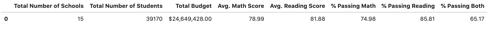
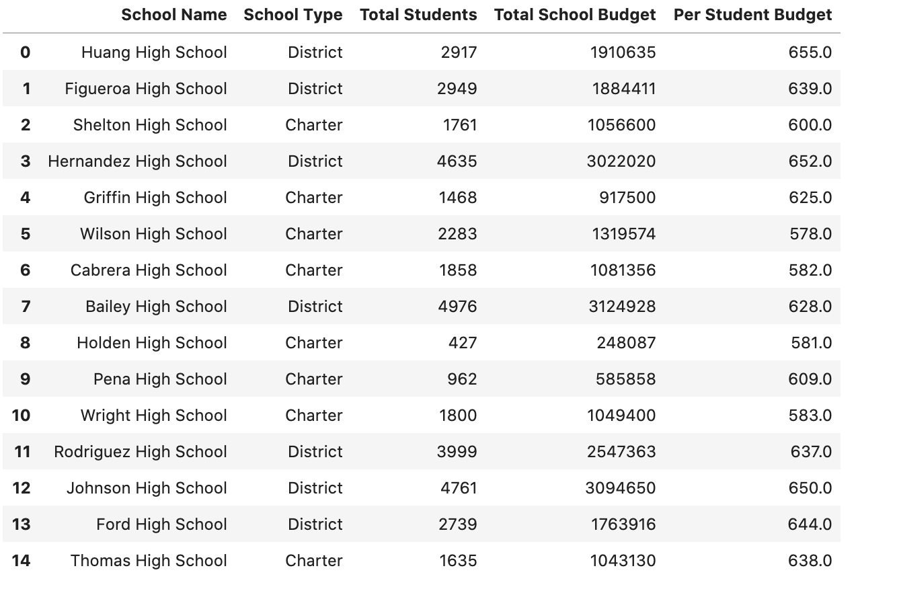
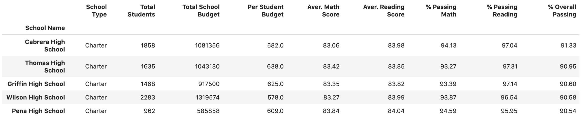
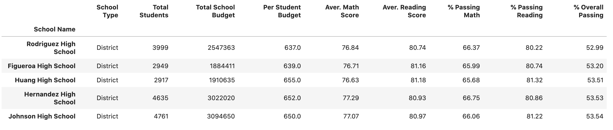
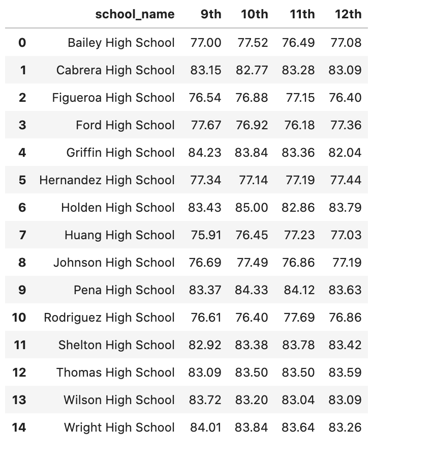
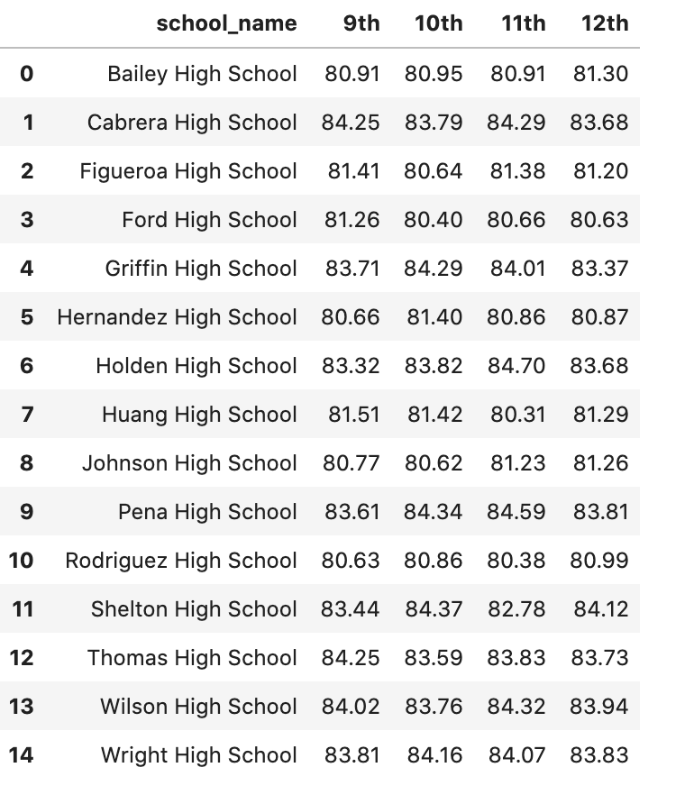
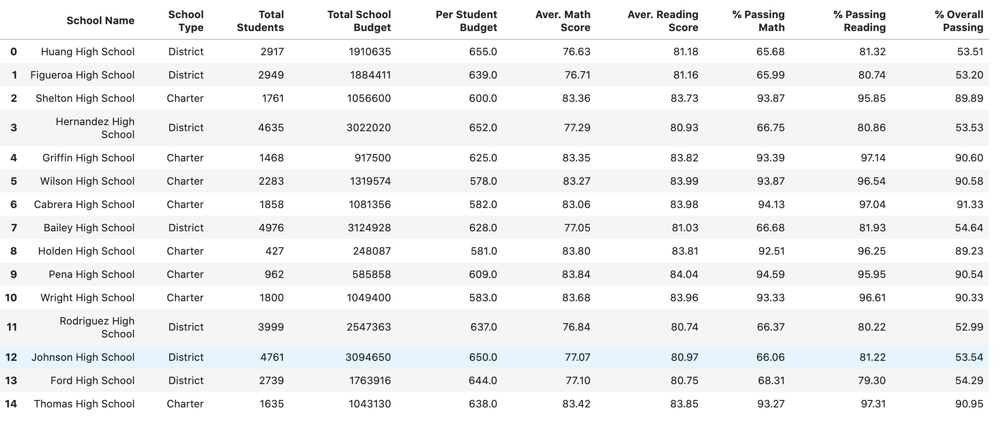
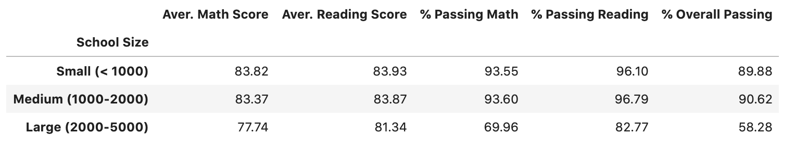
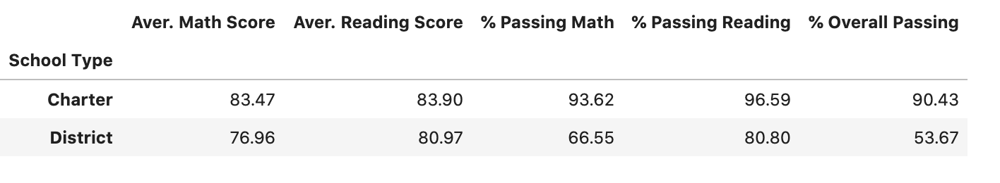

# Pandas-Challenge
I analyzed the district-wide standardized test results. I was given access to every student's math and reading scores, as well as various information on the schools they attend. My responsibility was to aggregate the data to and showcase obvious trends in school performance.

The final report included each of the following:

### 1. District Summary

* Create a high level snapshot (in table form) of the district's key metrics, including:
  * Total Schools
  * Total Students
  * Total Budget
  * Average Math Score
  * Average Reading Score
  * % Passing Math (The percentage of students that passed math.)
  * % Passing Reading (The percentage of students that passed reading.)
  * % Overall Passing (The percentage of students that passed math **and** reading.)
 
This is how distric summary looks like: 

### 2.School Summary

* Create an overview table that summarizes key metrics about each school, including:
  * School Name
  * School Type
  * Total Students
  * Total School Budget
  * Per Student Budget
  * Average Math Score
  * Average Reading Score
  * % Passing Math (The percentage of students that passed math.)
  * % Passing Reading (The percentage of students that passed reading.)
  * % Overall Passing (The percentage of students that passed math **and** reading.)

This is how school summary looks like: 

### 3.Top Performing Schools (By % Overall Passing)

* Create a table that highlights the top 5 performing schools based on % Overall Passing. Include:
  * School Name
  * School Type
  * Total Students
  * Total School Budget
  * Per Student Budget
  * Average Math Score
  * Average Reading Score
  * % Passing Math (The percentage of students that passed math.)
  * % Passing Reading (The percentage of students that passed reading.)
  * % Overall Passing (The percentage of students that passed math **and** reading.)

The list of top 5 schools are summarized in this table: 

### 4. Bottom Performing Schools (By % Overall Passing)

* Create a table that highlights the bottom 5 performing schools based on % Overall Passing. Include all of the same metrics as above.

The list of worst 5 performing schools are summarized in this table: 

### 5. Math Scores by Grade
* Create a table that lists the average Math Score for students of each grade level (9th, 10th, 11th, 12th) at each school.

The following table shows averages of Math scores by grade:

### 6. Reading Scores by Grade
* Create a table that lists the average Reading Score for students of each grade level (9th, 10th, 11th, 12th) at each school.

The following table shows averages of Reading scores by grade:

### 7. Scores by School Spending

* Create a table that breaks down school performances based on average Spending Ranges (Per Student). Use 4 reasonable bins to group school spending. Include in the table each of the following:
  * Average Math Score
  * Average Reading Score
  * % Passing Math (The percentage of students that passed math.)
  * % Passing Reading (The percentage of students that passed reading.)
  * % Overall Passing (The percentage of students that passed math **and** reading.)

The following table shows school spending:

### 8. Scores by School Size
* Repeat the above breakdown, but this time group schools based on a reasonable approximation of school size (Small, Medium, Large).
The following table shows school by size:

### 9. Scores by School Type

* Repeat the above breakdown, but this time group schools based on school type (Charter vs. District).
The following table shows scores by school type:

## Analysis

There are 15 schools, of which 7 are district and 8 are charter schools. According to the school summary table, charter schools receive less school budget compared to district schools, yet their overall passing percentages are higher than district schools. For example, the top 5 schools are all charter schools and bottom 5 schools are district schools. If we look at school size, all the district schools are in "large school" category with 2000-5000 students, that has overall passing percentage of 58.28%. Small and medium-sized schools are all charter schools with maximum number of students being 2000 and overall percentages are about 89.88& and 90.62%. If we look into test scores based on school type, charter schools have way high overall passing percentage of 90.43 compared to district schools' overall passing being 53.67%. These data shows that in this group of 15 schools, charter schools are doing way better despite of having less school budget. This might be due to smaller and medium classroom sizes, where students get more teacher time and individualized attention and instruction. 

